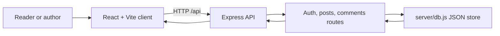

# Blog Platform

<p align="center"><strong>A full-stack blog prototype with a React reading experience and an Express API for accounts, posts, and comments.</strong></p>

<p align="center">React · Vite · Express · JSON file storage</p>

## Project overview

The client provides registration, login, a post feed, post details, post creation, and comments. The Express server exposes `/api/auth`, `/api/posts`, and `/api/comments`; `api/index.js` adapts the same routes for a serverless entry point.

## Architecture



## Run locally

Use Node.js. Open two terminals from the repository root:

```bash
cd server
npm install
npm run dev
```

```bash
cd client
npm install
npm run dev
```

Open the Vite URL printed by the client. Confirm the client API base URL in `client/vite.config.js` matches the local server; the server defaults to port `5000`.

## Storage and deployment limits

The server stores users, posts, and comments in `server/store.json`. This is suitable only for a local demo: concurrent writes are not coordinated, and many serverless hosts use ephemeral filesystems. The repository's serverless adapter does not turn this JSON file into a durable database. Use a managed database and add production-grade authentication/session protections before hosting real user accounts or content.

## Project structure

- `client/` — React pages and components
- `server/` — Express app, routes, middleware, and JSON data store
- `api/index.js` — serverless API adapter
- `vercel.json` — deployment routing
